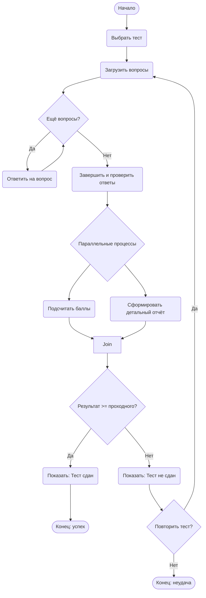

# Диаграмма деятельности: Прохождение теста в системе онлайн-обучения

## Описание процесса

Студент выбирает тест из доступных. Система загружает вопросы. Студент последовательно отвечает на вопросы. После завершения система проверяет ответы и параллельно выполняет два действия: подсчитывает баллы и формирует детальный отчёт. Затем выводится итоговый результат (сдан/не сдан). В случае несдачи можно перейти к повторному прохождению того же теста.

## Ключевые шаги

1. **Выбор теста** – студент выбирает одну из доступных попыток.

2. **Цикл ответов** – пока есть вопросы, студент отвечает на них.

3. **Проверка** – после завершения ответов система запускает проверку.

4. **Параллельные действия** – одновременно считаются баллы и формируется отчёт.

5. **Решение** – сравнивается результат с проходным баллом.

6. **Возможность повтора** – если тест не сдан, студент может начать его заново.

## Параллельные ветви (fork/join)

**Fork** — после проверки ответов поток разделяется на два параллельных:
- Подсчитать баллы
- Сформировать детальный отчёт

**Join** — оба потока должны завершиться, прежде чем система перейдёт к оценке результата.

Это моделирует реальное поведение: итог выводится только тогда, когда и баллы подсчитаны, и отчёт готов.

---

## Контрольные вопросы

**1. Что такое диаграмма деятельности и для чего она используется?**

Диаграмма деятельности — это вид UML, показывающий последовательность действий, ветвления, параллельные потоки и синхронизацию. Используется для моделирования бизнес-процессов, алгоритмов, сценариев использования и рабочих потоков.

---

**2. Чем диаграмма деятельности отличается от блок-схемы?**

Блок-схема обычно показывает алгоритм шаг за шагом без параллелизма. Диаграмма деятельности поддерживает:

    параллельные потоки (fork/join),

    синхронизацию,

    дорожки (swimlanes),

    более богатую семантику для бизнес-процессов.

---

**3. Как обозначается начальный узел в Mermaid?** 

([*]) или текстовый узел ([Начало]). Рекомендуется использовать ([Текст]) для наглядности.

---

**4. Как обозначается узел решения (ветвление)?**

В Mermaid — id{Текст} (ромб). Например: CheckPIN{PIN верен?}.

---

**5. Как в Mermaid реализовать параллельные ветви (fork/join)?**

Прямого символа «жирная черта» нет, но параллелизм моделируется так:

Fork: узел, из которого выходит несколько стрелок (например, Fork --> A и Fork --> B).

Join: узел, в который входит несколько стрелок (например, A --> Join и B --> Join).

---

**6. Зачем нужны узлы слияния (merge) и соединители (join)?**

Merge — собирает альтернативные потоки (после ветвления) в один без ожидания. Несколько входов → один выход.

Join — синхронизирует параллельные потоки: ждёт завершения всех входов, затем передаёт управление дальше.

---

**7. Какие правила именования действий вы знаете?**

Действия должны называться глаголами в начальной форме: «Проверить», «Вычислить», «Загрузить».

    Название должно быть кратким и понятным.

    Избегать пассивного залога.

---

**8. Можно ли на одной диаграмме деятельности иметь несколько конечных узлов?**

Да, это допустимо. Разные сценарии могут приводить к разным завершениям (успех, ошибка, отмена). Каждый конечный узел обозначается кружком с точкой внутри или текстовым узлом ([Конец]).

## Источники

- [Mermaid.js Documentation](https://mermaid.js.org/syntax/flowchart.html) — синтаксис flowchart и моделирование fork/join.
- [OMG UML Specification 2.5.1](https://www.omg.org/spec/UML/2.5.1) — официальное описание activity diagrams.
- Буч Г., Рамбо Д., Якобсон А. — «Язык UML. Руководство пользователя», 2021.
- Mermaid Live Editor: https://mermaid.live
- Материалы практической работы №15 (кафедра программной инженерии, 2026).