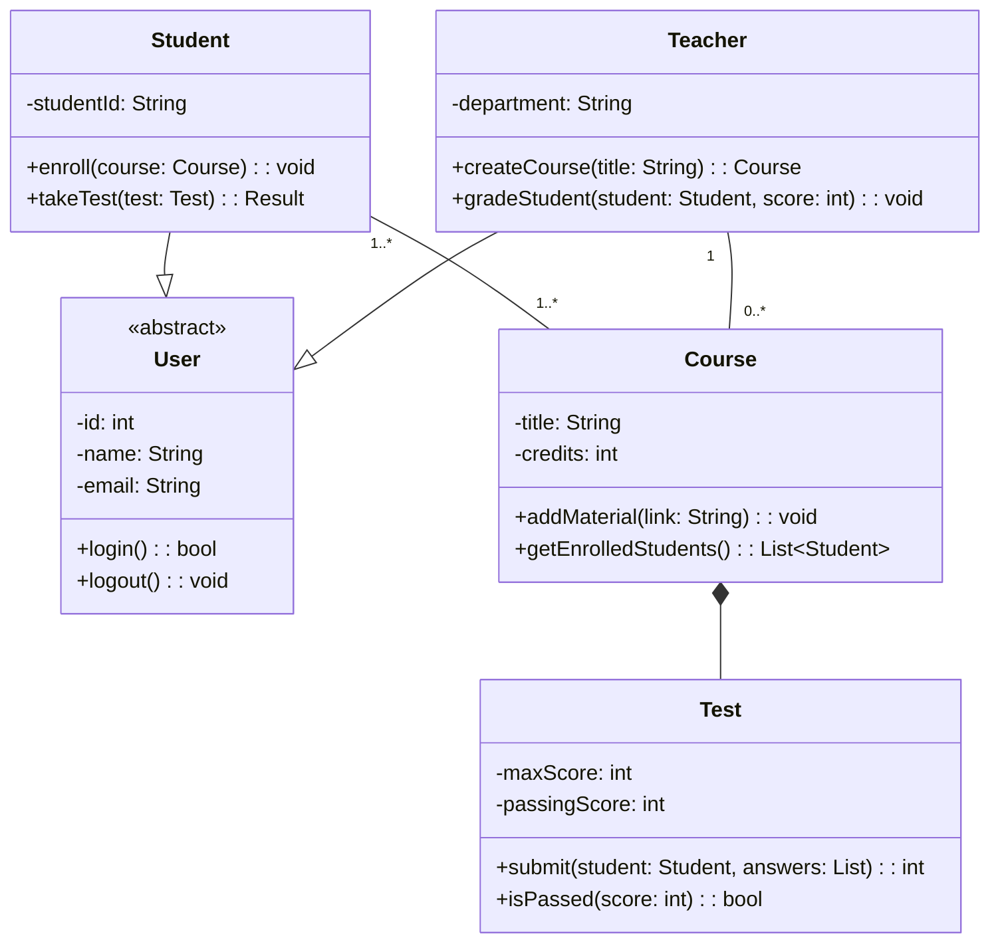

# Диаграмма классов: Система онлайн-обучения

## Описание предметной области

Система онлайн-обучения позволяет студентам записываться на курсы, проходить тесты и просматривать оценки. Преподаватели создают курсы, загружают материалы и проверяют задания. Администратор управляет пользователями и формирует отчёты. Каждый курс содержит учебные материалы и тесты. Студент может оставить отзыв на курс.

Основные классы:

- Пользователь (абстрактный) — общий предок для Студента, Преподавателя и Администратора.

- Курс — центральный элемент системы.

- Тест, Вопрос, РезультатТеста — для проверки знаний.

- Отзыв — связь студента с курсом.


---

## Список классов с пояснением их роли
- **User** - Абстрактный базовый класс - Хранит общие данные всех пользователей системы (id, имя, email). Предоставляет методы входа и выхода из системы. Не может существовать сам по себе — только через наследников.
  
- **Student** -	Наследник User - Представляет студента. Может записываться на курсы (enroll) и проходить тесты (takeTest). Имеет уникальный номер студенческого билета.
 
- **Teacher** -	Наследник User - Представляет преподавателя. Может создавать курсы (createCourse) и выставлять оценки студентам (gradeStudent). Принадлежит определённой кафедре.

- **Course** -	Курс обучения - Содержит название и количество кредитов. Позволяет добавлять учебные материалы и получать список записанных студентов. Является «контейнером» для тестов.

- **Test** -	Тест, привязанный к курсу - Хранит максимальный и проходной баллы. Позволяет студенту отправить ответы и проверить, сдан ли тест.

## Описание ключевых отношений

- **Student --|> User**:	Наследование — Студент «является разновидностью» Пользователя. Он наследует все атрибуты и методы User (id, name, email, login, logout) и добавляет свои собственные (studentId, enroll, takeTest).	

- **Teacher --|> User**	Наследование — Преподаватель также «является разновидностью» Пользователя.	

- **Course *-- Test**	Композиция — Тест не может существовать без Курса. Если курс удаляется, все связанные с ним тесты также удаляются. Это «жёсткая» связь: жизненный цикл теста полностью зависит от курса.	

- **Student "1..*" -- "1..*"** Course	Ассоциация (многие ко многим) — Один студент может быть записан на много курсов, и на один курс может быть записано много студентов. Это типичная связь в любой системе онлайн-обучения.	

- **Teacher "1" -- "0..*"** Course	Ассоциация (один ко многим) — Один преподаватель может вести несколько курсов (или не вести ни одного — 0..*). Курс не может быть создан без преподавателя, но преподаватель может существовать без курсов.
  
---

## Объяснение выбранных типов связей

**Наследование (`Student --|> User`, `Teacher --|> User`)**  
Student и Teacher имеют общие атрибуты (id, имя, email) и методы (login, logout). Вынесение их в абстрактный класс User устраняет дублирование.

**Композиция (`Course *-- Test`)**  
Тест не существует без курса. Если курс удаляется, тест тоже удаляется. Это жёсткая связь — тест полностью принадлежит курсу.

**Ассоциация «многие ко многим» (`Student "1..*" -- "1..*" Course`)**  
Студент может учиться на нескольких курсах одновременно. Курс может содержать много студентов. Прямое отражение реального учебного процесса.

**Ассоциация «один ко многим» (`Teacher "1" -- "0..*" Course`)**  
Преподаватель может вести несколько курсов (или ни одного). Курс ведёт ровно один преподаватель.

**Почему нет агрегации?**  
Агрегация (`o--`) используется, когда часть может переходить из одного целого в другое (например, игрок — между командами). В данной модели такой сценарий отсутствует, поэтому достаточно композиции и ассоциаций.

--- 

## Контрольные вопросы
## 1. Что такое диаграмма классов и для чего она используется?

Диаграмма классов — это основной вид диаграмм статической структуры в UML. Она показывает классы системы, их атрибуты, методы и связи между ними. Используется для документирования архитектуры, генерации кода и проектирования баз данных.

---

## 2. Какие три основные секции имеет прямоугольник класса?

    Имя класса (обязательно, жирным шрифтом).

    Атрибуты (свойства класса с указанием видимости и типа).

    Методы (операции с видимостью, параметрами и возвращаемым типом).

---

## 3. Что означают символы ‘+’, ‘-’, ‘#’ перед атрибутами и методами?

    + — public (доступен всем).

    - — private (доступен только внутри класса).

    # — protected (доступен внутри класса и его наследникам).

---

## 4. Как в Mermaid обозначается наследование?

ChildClass --|> ParentClass

---

## 5. В чём разница между агрегацией и композицией?

Агрегация (o--) — часть может существовать независимо от целого (например, игрок может перейти в другую команду).

Композиция (*--) — часть не может существовать без целого (например, комнаты не существуют без дома).

---

## 6. Как указать множественность отношения (например, «один ко многим»)?

В Mermaid множественность указывается в кавычках у концов связи:

```
ParentClass "1" -- "0..*" ChildClass
```

---

## 7. Как изобразить интерфейс в Mermaid?

```
classDiagram
    class НазваниеИнтерфейса {
        <<interface>>
        +метод(): тип
    }
```
---

## 8. Какую информацию можно указать в сигнатуре метода?

    Видимость (+, -, #)

    Имя метода

    Параметры (имя и тип, возможно значение по умолчанию)

    Возвращаемый тип

