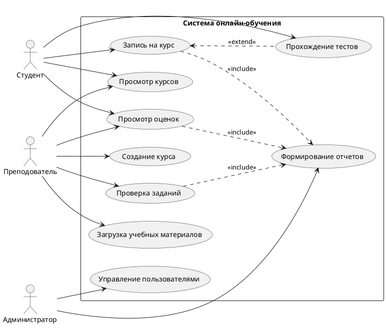

```puml
@startuml
left to right direction
skinparam packageStyle rectangle

actor "Студент" as student
actor "Преподователь" as teacher
actor  "Администратор" as admin

rectangle "Система онлайн-обучения" {
    usecase "Просмотр курсов" as UC1
    usecase "Запись на курс" as UC2
    usecase "Прохождение тестов" as UC3
    usecase "Просмотр оценок" as UC4
    usecase "Загрузка учебных материалов" as UC5
    usecase "Создание курса" as UC6
    usecase "Проверка заданий" as UC7
    usecase "Управление пользователями" as UC8
    usecase "Формирование отчетов" as UC9

    student --> UC1
    student --> UC2
    student --> UC3
    student --> UC4

    teacher --> UC1
    teacher --> UC5
    teacher --> UC6
    teacher --> UC7
    teacher --> UC4

    admin --> UC8
    admin --> UC9

    UC2 ..> UC9 : <<include>>
    UC4 ..> UC9 : <<include>>
    UC7 ..> UC9 : <<include>>

    UC2 <.. UC3 : <<extend>>
}
@enduml
```